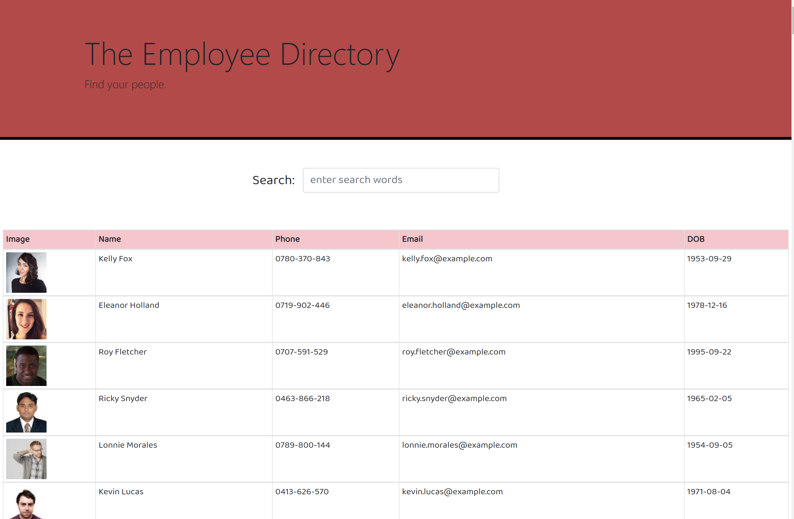
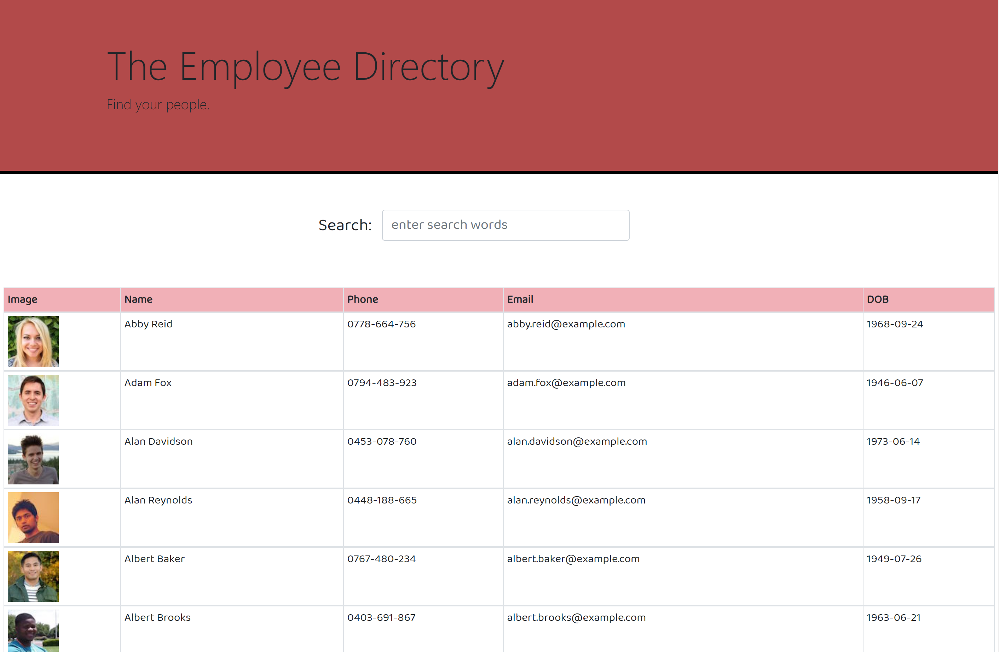
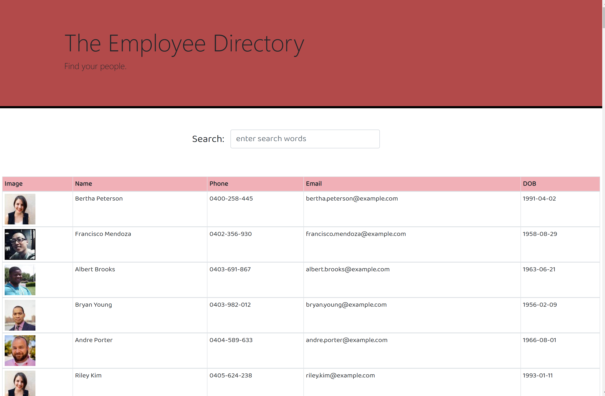
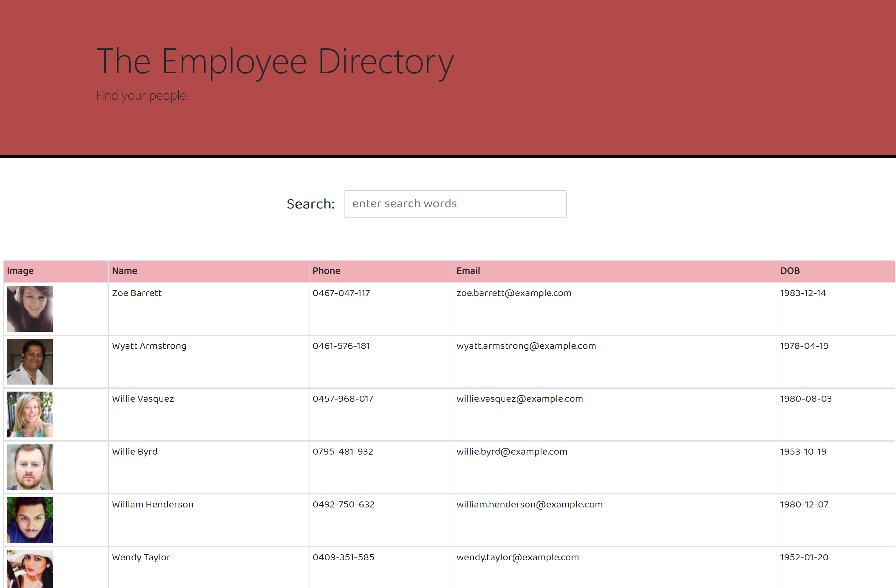
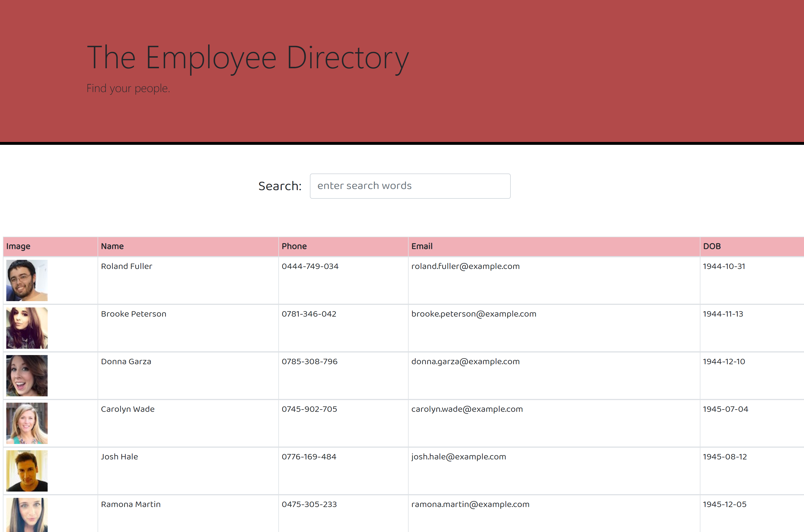
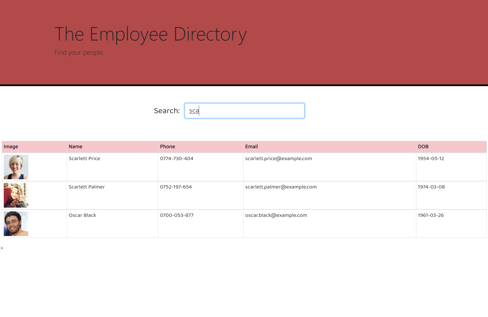

# week19-employeedirectory

+ Github link: https://github.com/sevenspell/employeedirectory/

+ Deployed Github Page: https://sevenspell.github.io/employeedirectory/

## Description 

This React App project is designed to create a dynamic employee directory that allows sorting of employee data by different fields, as well as to narrow down search by name.

This front-end client-side only application was built using React, React Components, useState, and JSX amongst other React functionalities.

## Applications Used
+ React

## Usage 

1. Go to deployed Github app link: https://sevenspell.github.io/employeedirectory/

2. Sort name once, and it should show data in ascending order. Click again to see data in descending order.

3. Sort by phone number.

4. Sort (descending) by email address.

5. Sort by Date Of Birth(dob).

6. Enter your desired search word in the search bar. In this case, 'sca' retrieves all data for names that contains 'sca'.

## Credits
I got a deeper understanding of React from Wagner (https://wagner-lopes.github.io/) and some guidance from Sandesh as well as some reference from Takuji's work.
